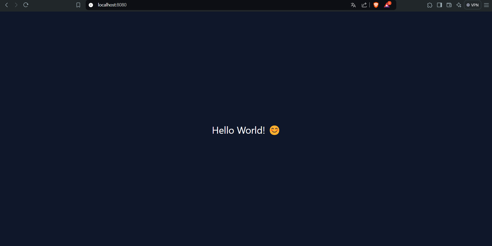
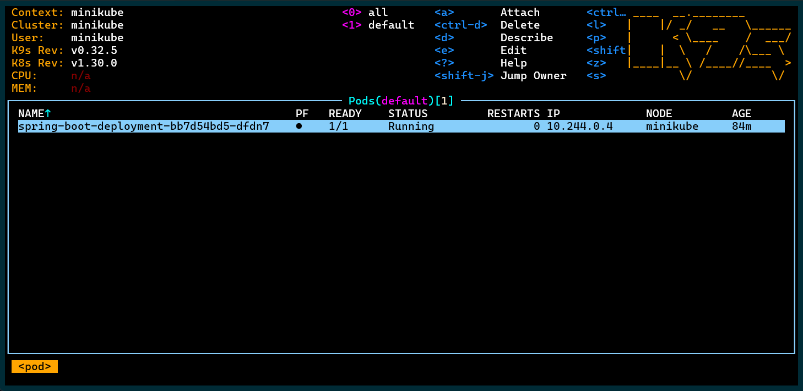

## ✅ `Spring Boot Thymeleaf Docker Github Actions Kubernetes`

 

<h3>⚡Home</h3>

<h3>⚡K9S</h3>

 

 

 

Used Technologies in The Project:

 

# License

This project is licensed under the MIT License. See the [LICENSE](LICENSE) file for details

Created by [Mehmet Furkan KAYA](https://www.linkedin.com/in/mehmet-furkan-kaya/)
